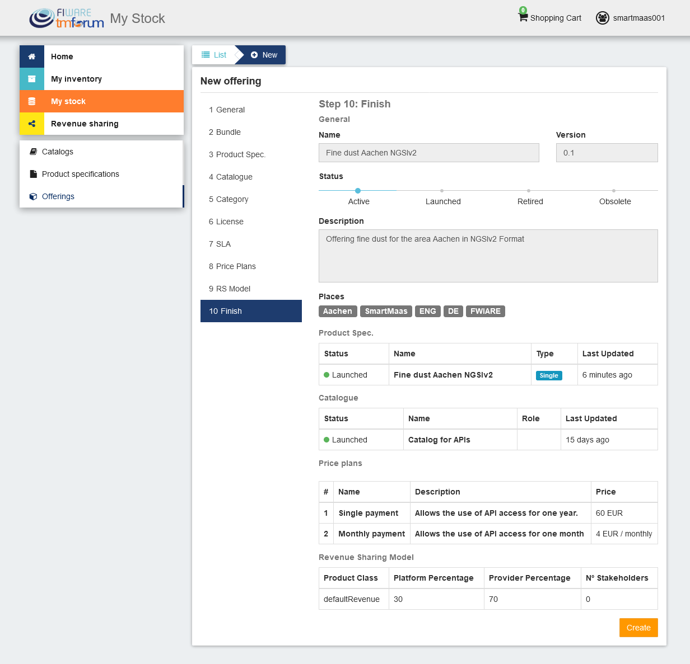
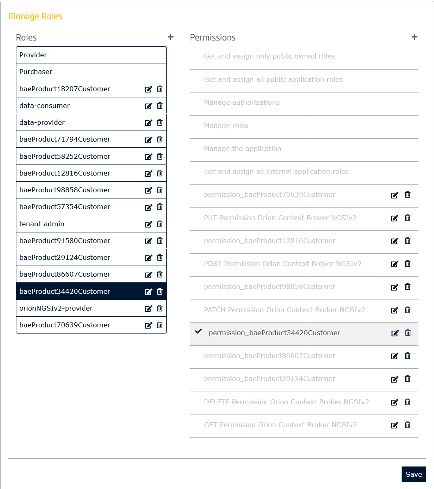
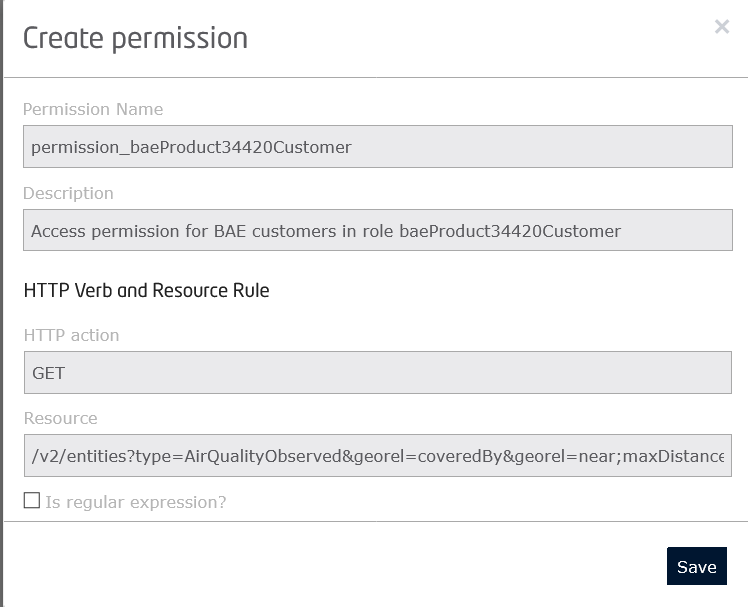

# BAE SmartMaaS NGSI Plugin
[](https://www.fiware.org/developers)
[](https://fiware-ges.github.io/orion/api/v2/stable/)
[](https://www.etsi.org/deliver/etsi_gs/CIM/001_099/009/01.02.01_60/gs_cim009v010201p.pdf)

[](https://www.fiware.org/developers/catalogue/)
[](https://opensource.org/licenses/MIT)
[](https://stackoverflow.com/questions/tagged/fiware)

[](https://business-api-ecosystem.rtfd.io)

This plugin is for the Business API Ecosystem and allows sellers to sell API accesses to 
<b>NGSIv2</b> and <b>NGSI-LD</b> data which are published e.g. under [APInf](https://github.com/apinf/apinf-umbrella).

It was created explicitly for the SmartMaaS project and can be installed for use in the [Smart Platform Services](https://github.com/SmartMaaS-Services/dev.smartmaas.services).

The plugin is designed for the special architecture of the FIWARE SmartMaaS platform. 
It covers rights and access management between the [Tenant-Manager](https://github.com/Profirator/tenant-manager), 
[Umbrella](https://github.com/Profirator/api-umbrella) and [Keyrock](https://github.com/ging/fiware-idm) components, 
with Keyrock taking over central authorization control via OAuth2.

## Content ##
- [Prerequisites](#prerequisites)
- [Important information for plugin usage](#important-information-for-plugin-usage)
- [User Guide](#user-guide)
- [Installation](#installation)

## Prerequisites ##

Before you decide to install the plugin in your Business API Ecosystem, please read the corresponding 
[documentation](https://business-api-ecosystem.readthedocs.io/en/latest/user-guide.html) in advance.

There it is explained in detail, which functions the Business API Ecosystem offers and how you can generally create a 
product and an offer.
Furthermore, you will get an overview which authorization you get with the respective internal roles of the 
Business API Ecosystem.

The internal roles of the Business API Ecosystem must be set in the application in Keyrock and assigned to the 
respective users who should be granted access to the marketplace.

A Product can generally be created by users in the Business API Ecosystem who have the role `seller` in the Keyrock 
application of the Business API Ecosystem.

<p align="center">
    
</p>

If the user of the Business API Ecosystem has the `seller` role, he will be able to monetize his products by creating, 
catalogs, product specifications and product offerings. The role `customer` should have all users of the system by 
default to have the authorization to log in to the Business API Ecosystem.


## Important information for plugin usage

If you want to offer NGSIv2 or NGSI-LD data in the Business API Ecosystem, please be aware of the 
following rules when using the plugin:
                                                                                    
Since the Business API Ecosystem does not currently support multi-tenancy, tenants containing NGSIv2 or NGSI-LD data 
are only allowed to be created in the Tenant-Manager by one user, the <b>tenant-admin</b>.
The tenant-admin should be an employee in your company who should be responsible for managing the tenants on this platform.

The login data of the tenant-admin is required for the configuration of the plugin and is crucial for the functionality 
of the plugin. <b>Only the NGSI data that is stored in the tenants created by the tenant-admin can be sold in the 
marketplace using this plugin.</b> 

Furthermore, it should be ensured that the IDP Mode for the Orion NGSIv2 and NGIS-LD is set to Authorization in the 
API Backend in Umbrella. Exact instructions regarding the configurations to be performed in advance can be found at 
[Smart-Platform-Services](https://github.com/SmartMaaS-Services/dev.smartmaas.services).


## User Guide

### Initial situation:

In our example, the user admin (default admin in Keyrock) is the tenant-admin on our platform.

He has created the tenant smartmaas001 in the tenant manager.

<p align="center">
    
</p>

The tenant contains e.g. NGSIv2 data. User admin adds user yclausen as data-provider to smartmaas001.
In addition, yclausen is authorized as a seller in Keyrock's Business API Ecosystem application.

User yclausen logs into Business API Ecosystem to create a product and quote for AirQualityObserved.

The following steps are then to be performed:

1)  User yclausen changes to organization smartmaas001.

    <p align="center">
        
    </p>
    
    Only the user admin, can stay in the marketplace on his user to directly create products for smartmaas001.
    The reason is that he created the tenant in the tenant manager and is the owner.
    
2)  Create catalog under which the product will be filed.

    <p align="center">
        
    </p>

3) Create the product for the NGSIv2 data

    <p align="center">
        
    </p>
    
    <p align="center">
        
    </p>
    
    <p align="center">
        
    </p>
    
    <p align="center">
        
    </p>
    
    When the product is stored, an product specific role and permission for read access to the data will be created 
    automatically in the background process in Keyrock. This role is stored in the API Catalogue application and will 
    be assigned to the user when the product is purchased.
    
    <p align="center">
        
    </p>
        
    <p align="center">
        
    </p>

4)  After the product for NGSIv2 data is created with the plugin, you can submit an appropriate offer for selling 
    of the product. The creation of an offer is described in detail in the documentation of Business API Ecosystem.
    

When a customer purchases the product, the customer is automatically added to the tenant as a data-consumer in 
Tenant-Manager and will be assigned the product-specific role in Keyrock. This gives the customer the appropriate read 
access.
    
Since the data can only be retrieved by applying a bearer token, the customer only needs to access the APInf 
platform after completing the purchase and retrieve the required bearer token via the Tenant-Manager.
    


## Installation

* Create zip file

```bash
sudo apt install zip

zip smartmaas-ngsi-query.zip smartmaas_ngsi_query.py keyrock_client.py package.json settings.py tenant_manager_client.py
```

* Copy zip file into business-ecosystem-charging-backend container

```bash
sudo docker cp smartmaas-ngsi-query.zip <container-id>:/business-ecosystem-charging-backend/src/plugins/
```

* Load Plugin

```bash
./manage.py loadplugin ./plugins/smartmaas-ngsi-query.zip
```

## Plugin Management

* List available plugins

```bash
python manage.py listplugins
```

This command will return the list of available plugins including the id that have been generated for them

* Uninstallation

```bash
python manage.py removeplugin <plugin-id>
```